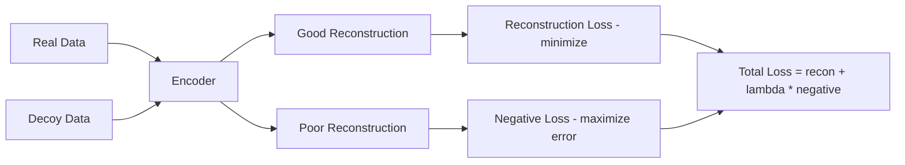

# Negative Contrastive Loss with Decoys — Implementation Plan

**Date:** 2026-07-01  
**Status:** Planning  
**Target file:** `src/valpas/_core/autoencoder.py`

---

## Concept

The standard masked reconstruction loss trains the autoencoder to reconstruct real proteomics data. A **negative contrastive loss** adds a complementary objective: the model should produce *poor* reconstructions (or distant embeddings) for **decoy inputs** — randomized versions of real data that destroy biological signal while preserving statistical properties.

This teaches the model to distinguish genuine co-expression patterns from noise, improving the quality of learned protein embeddings.



---

## Decoy Generation Strategies

Multiple strategies for generating decoys, each destroying different aspects of biological structure:

| Strategy | What it destroys | Implementation |
|----------|-----------------|----------------|
| `row_shuffle` | Per-protein expression patterns across samples | Independently shuffle each row |
| `col_shuffle` | Per-sample co-expression across proteins | Independently shuffle each column |
| `full_shuffle` | All structure | Shuffle entire matrix flat |
| `gaussian` | Replace with matched Gaussian noise | Same mean/std per row or globally |
| `block_shuffle` | Local co-expression blocks | Shuffle contiguous blocks of rows |

### Default recommendation: `row_shuffle`

Row shuffling preserves marginal distributions per protein but destroys the sample-to-sample correlation structure that defines protein co-expression — exactly what the autoencoder should learn.

---

## Loss Formulations

Three configurable negative loss functions:

### 1. `margin` (default) — Margin-based repulsion

```python
neg_loss = max(0, margin - reconstruction_error_on_decoy)
```

Pushes decoy reconstruction error above a minimum margin. Once the model is "bad enough" at reconstructing decoys, gradient stops — prevents collapse.

### 2. `negative_mse` — Negative reconstruction error

```python
neg_loss = -MSE(reconstruction_of_decoy, decoy_input)
```

Directly maximizes reconstruction error on decoys. Simpler but can be unstable without clipping.

### 3. `log_ratio` — Log-ratio of errors

```python
neg_loss = -log(error_on_decoy / (error_on_real + eps))
```

Encourages the ratio of decoy error to real error to be large. Self-normalizing.

---

## Parameters

New parameters to add to `train_proteomics_autoencoder` and `autoencoder_args`:

```python
contrastive_args: dict = {
    'enabled': False,                    # Enable/disable negative contrastive loss
    'decoy_strategy': 'row_shuffle',     # One of: row_shuffle, col_shuffle, full_shuffle, gaussian, block_shuffle
    'n_decoys': 1,                       # Number of decoy variants per real batch
    'loss_type': 'margin',               # One of: margin, negative_mse, log_ratio
    'lambda_negative': 0.1,              # Weight of negative loss relative to reconstruction
    'margin': 1.0,                       # Margin for margin-based loss (ignored for other types)
    'warmup_epochs': 10,                 # Epochs of pure reconstruction before adding negative loss
    'max_lambda': 0.5,                   # Maximum lambda (for linear ramp-up schedule)
    'decoy_mask_probability': None,      # If set, apply masking to decoys too (None = same as real)
    'clip_negative_loss': 10.0,          # Clip negative loss to prevent instability
}
```

---

## Architecture Changes

### New class: `DecoyGenerator`

```python
class DecoyGenerator:
    """Generates decoy inputs from real data using configurable strategies."""
    
    def __init__(self, strategy: str = 'row_shuffle', n_decoys: int = 1):
        self.strategy = strategy
        self.n_decoys = n_decoys
    
    def generate(self, real_data: torch.Tensor) -> torch.Tensor:
        """
        Generate decoy batch from real data.
        
        Args:
            real_data: [B, n_proteins, n_samples]
        Returns:
            decoys: [B * n_decoys, n_proteins, n_samples]
        """
        ...
```

### New class: `NegativeContrastiveLoss`

```python
class NegativeContrastiveLoss(nn.Module):
    """Computes negative contrastive loss on decoy reconstructions."""
    
    def __init__(self, loss_type='margin', margin=1.0, clip_value=10.0):
        ...
    
    def forward(self, decoy_input, decoy_reconstruction, real_loss):
        """
        Args:
            decoy_input: original decoy tensor
            decoy_reconstruction: model output for decoy
            real_loss: reconstruction loss on real data (for log_ratio)
        Returns:
            negative_loss: scalar tensor
        """
        ...
```

### Modified: `ProteomicsAutoencoderTrainer.train_epoch()`

```python
def train_epoch(self, dataset, device, n_batches=100, mini_batch_size=10):
    ...
    for i in range(0, n_batches, mini_batch_size):
        # ... existing mask generation ...
        
        # Reconstruction loss (existing)
        reconstruction = self.model(masked_data)
        recon_loss = self.criterion(reconstruction[masks], target[masks])
        
        # Negative contrastive loss (new, conditional)
        if self.use_contrastive and epoch >= self.contrastive_warmup:
            decoys = self.decoy_generator.generate(data_expanded)
            decoys = decoys.to(device)
            decoy_reconstruction = self.model(decoys)
            neg_loss = self.negative_loss(decoys, decoy_reconstruction, recon_loss)
            
            # Lambda scheduling (linear ramp-up after warmup)
            current_lambda = self._get_current_lambda(epoch)
            total_loss = recon_loss + current_lambda * neg_loss
        else:
            total_loss = recon_loss
        
        total_loss.backward()
        ...
```

---

## Lambda Scheduling

Linear ramp-up prevents destabilizing early training:

```
lambda(epoch) = 
    0                                           if epoch < warmup_epochs
    lambda_negative + (max_lambda - lambda_negative) * (epoch - warmup) / ramp_epochs   during ramp
    max_lambda                                  after ramp complete
```

---

## Integration with Existing API

### `valpas_core.py` — `autoencoder_args` dict

Add to default `autoencoder_args`:

```python
autoencoder_args: dict = {
    'protein_embedding_dim': 128,
    'sample_embedding_dim': 64,
    'hidden_dims': [256, 128],
    'epochs': 200,
    'learning_rate': 1e-3,
    'mask_probability': 0.15,
    'scaling_method': 'robust',
    'validation_split': 0.2,
    # New:
    'contrastive_args': {
        'enabled': False,
        'decoy_strategy': 'row_shuffle',
        'n_decoys': 1,
        'loss_type': 'margin',
        'lambda_negative': 0.1,
        'margin': 1.0,
        'warmup_epochs': 10,
        'max_lambda': 0.5,
        'clip_negative_loss': 10.0,
    }
}
```

### Backward Compatibility

- `contrastive_args['enabled'] = False` by default — no behavior change
- All contrastive parameters are optional with sensible defaults
- Training history will include `negative_losses` list when enabled

---

## Implementation Steps

1. Create `DecoyGenerator` class with all 5 strategies
2. Create `NegativeContrastiveLoss` class with 3 loss types
3. Add lambda scheduling helper to trainer
4. Modify `ProteomicsAutoencoderTrainer.__init__()` to accept contrastive config
5. Modify `train_epoch()` to generate decoys and compute combined loss
6. Thread `contrastive_args` through `train_proteomics_autoencoder()` → trainer
7. Update `valpas_core.py` default `autoencoder_args` 
8. Add training history tracking for negative loss component
9. Write unit tests for each decoy strategy
10. Write integration test verifying training with contrastive loss completes

---

## Testing Strategy

1. **DecoyGenerator tests** — verify each strategy produces correct shapes and destroys expected structure
2. **NegativeContrastiveLoss tests** — verify each loss type returns expected gradients
3. **Warmup test** — verify negative loss is zero during warmup epochs
4. **Lambda schedule test** — verify ramp-up behavior
5. **End-to-end test** — train with contrastive enabled, verify convergence
6. **Backward compat test** — verify `enabled=False` produces identical results to no-contrastive baseline
