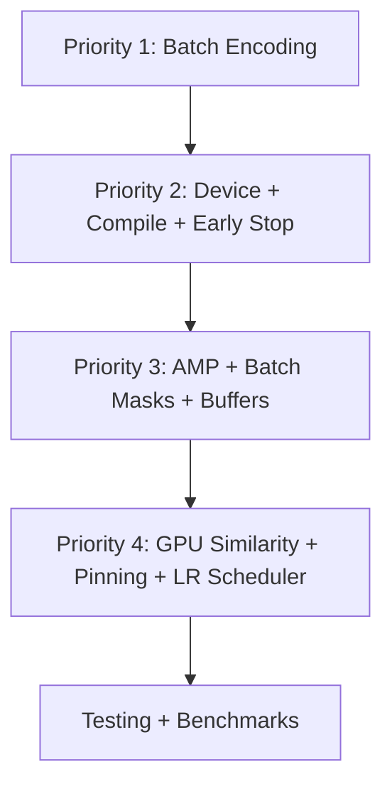

# VaLPAS Autoencoder Performance Implementation Plan

**Date:** 2026-06-30  
**Based on:** `plans/PERFORMANCE_PLAN.md`  
**Target file:** `src/valpas/_core/autoencoder.py`

---

## Overview

This plan translates the 6 identified bottlenecks into concrete, ordered implementation steps. All changes target `src/valpas/_core/autoencoder.py` unless noted otherwise.



---

## Priority 1 — Critical: Eliminate Sequential Loops

### Step 1a: Batch `encode_proteins` (line 188–199)

**Current code** iterates over `self.n_proteins` in a Python for-loop, calling `self.protein_encoder` once per protein.

**Change:** Replace the loop with a reshape + single forward pass.

```python
def encode_proteins(self, x: torch.Tensor) -> torch.Tensor:
    # x: [batch_size, n_proteins, n_samples]
    batch_size = x.shape[0]
    x_flat = x.reshape(-1, self.n_samples)  # [batch_size * n_proteins, n_samples]
    embeddings = self.protein_encoder(x_flat)  # [batch_size * n_proteins, protein_embedding_dim]
    return embeddings.reshape(batch_size, self.n_proteins, -1)
```

**Why it works:** `nn.Linear` supports arbitrary leading batch dimensions. Reshaping `[B, P, S]` → `[B*P, S]` feeds all proteins as a single batch through the same network.

### Step 1b: Batch `encode_samples` (line 201–212)

Same pattern, transposing first:

```python
def encode_samples(self, x: torch.Tensor) -> torch.Tensor:
    # x: [batch_size, n_proteins, n_samples]
    batch_size = x.shape[0]
    x_t = x.transpose(1, 2).reshape(-1, self.n_proteins)  # [batch_size * n_samples, n_proteins]
    embeddings = self.sample_encoder(x_t)  # [batch_size * n_samples, sample_embedding_dim]
    return embeddings.reshape(batch_size, self.n_samples, -1)
```

**Validation:** After implementation, add a temporary assertion comparing output of old loop vs new batched version on random input with fixed seed.

---

## Priority 2 — High: Device, Compile, Early Stopping

### Step 2a: Add `get_optimal_device()` utility function

Add as a module-level function before `train_proteomics_autoencoder`:

```python
def get_optimal_device() -> torch.device:
    if torch.cuda.is_available():
        device = torch.device('cuda')
        print(f"Using CUDA: {torch.cuda.get_device_name(0)}")
    elif hasattr(torch.backends, 'mps') and torch.backends.mps.is_available():
        device = torch.device('mps')
        print("Using Apple Metal - MPS")
    else:
        device = torch.device('cpu')
        n_threads = min(os.cpu_count() or 4, 8)
        torch.set_num_threads(n_threads)
        print(f"Using CPU with {n_threads} threads")
    return device
```

Update `train_proteomics_autoencoder` to use this:
```python
if device is None:
    device = get_optimal_device()
```

### Step 2b: Add `torch.compile()` wrapper

After model creation in `train_proteomics_autoencoder` (after line ~390):

```python
if hasattr(torch, 'compile'):
    try:
        model = torch.compile(model)
        print("Model compiled with torch.compile()")
    except Exception as e:
        print(f"torch.compile() failed, using eager mode: {e}")
```

### Step 2c: Add early stopping

Add `patience` and `min_delta` parameters to `train_proteomics_autoencoder`:

```python
def train_proteomics_autoencoder(
    ...
    early_stopping_patience: int = 20,
    min_delta: float = 1e-5,
    ...
)
```

Replace the training loop (line ~400–410):

```python
best_val_loss = float('inf')
patience_counter = 0
best_model_state = None

for epoch in range(epochs):
    train_loss = trainer.train_epoch(dataset, device)
    train_losses.append(train_loss)

    if epoch % 10 == 0:
        val_loss = trainer.validate(dataset, device)
        val_losses.append(val_loss)
        print(f"Epoch {epoch+1}/{epochs}, Train: {train_loss:.6f}, Val: {val_loss:.6f}")

        if val_loss < best_val_loss - min_delta:
            best_val_loss = val_loss
            patience_counter = 0
            best_model_state = {k: v.clone() for k, v in model.state_dict().items()}
        else:
            patience_counter += 1
            if early_stopping_patience > 0 and patience_counter >= early_stopping_patience:
                print(f"Early stopping at epoch {epoch+1}")
                if best_model_state:
                    model.load_state_dict(best_model_state)
                break
```

**Note:** `early_stopping_patience=0` disables early stopping for backward compatibility.

---

## Priority 3 — Medium: Efficiency Improvements

### Step 3a: Mixed precision training (CUDA only)

Add to `ProteomicsAutoencoderTrainer.__init__`:

```python
self.use_amp = device.type == 'cuda'
if self.use_amp:
    self.scaler = torch.amp.GradScaler('cuda')
```

Update `train_epoch`:

```python
if self.use_amp:
    with torch.amp.autocast('cuda'):
        reconstruction = self.model(masked_data)
        loss = self.criterion(reconstruction[mask], target[mask])
    self.scaler.scale(loss).backward()
    self.scaler.step(self.optimizer)
    self.scaler.update()
else:
    reconstruction = self.model(masked_data)
    loss = self.criterion(reconstruction[mask], target[mask])
    loss.backward()
    self.optimizer.step()
```

### Step 3b: Batch mask generation

Replace the per-iteration `create_masked_batch()` call in `train_epoch` with bulk generation:

```python
def train_epoch(self, dataset, device, n_batches=100, mini_batch_size=10):
    self.model.train()
    total_loss = 0.0
    n_steps = 0

    for i in range(0, n_batches, mini_batch_size):
        B = min(mini_batch_size, n_batches - i)
        masks = torch.rand(B, dataset.n_proteins, dataset.n_samples) < dataset.mask_probability
        data_expanded = dataset.data_tensor.unsqueeze(0).expand(B, -1, -1)
        masked_data = data_expanded.clone()
        masked_data[masks] = 0

        masked_data = masked_data.to(device)
        masks = masks.to(device)
        target = data_expanded.to(device)

        self.optimizer.zero_grad()
        reconstruction = self.model(masked_data)
        loss = self.criterion(reconstruction[masks], target[masks])
        loss.backward()
        self.optimizer.step()

        total_loss += loss.item()
        n_steps += 1

    return total_loss / n_steps
```

### Step 3c: Pre-allocate mask buffer

For the single-batch case (validation), add buffer reuse to `ProteomicsDataset`:

```python
def __init__(self, ...):
    ...
    self._mask_buffer = torch.empty(self.n_proteins, self.n_samples)
    self._masked_data_buffer = torch.empty_like(self.data_tensor)

def create_masked_batch(self, batch_size=1):
    self._mask_buffer.uniform_()
    mask = self._mask_buffer < self.mask_probability
    self._masked_data_buffer.copy_(self.data_tensor)
    self._masked_data_buffer[mask] = 0
    return self._masked_data_buffer.unsqueeze(0), mask.unsqueeze(0), self.data_tensor.unsqueeze(0)
```

---

## Priority 4 — Low: Production Optimizations

### Step 4a: GPU-accelerated similarity matrix

Replace sklearn cosine_similarity with torch operations in `calculate_protein_similarity_matrix`:

```python
if similarity_metric == 'cosine':
    emb_tensor = torch.from_numpy(protein_embeddings).to(device)
    emb_norm = F.normalize(emb_tensor, dim=-1)
    similarity_matrix = torch.mm(emb_norm, emb_norm.t()).cpu().numpy()
elif similarity_metric == 'correlation':
    emb_tensor = torch.from_numpy(protein_embeddings).to(device)
    centered = emb_tensor - emb_tensor.mean(dim=1, keepdim=True)
    centered_norm = F.normalize(centered, dim=-1)
    similarity_matrix = torch.mm(centered_norm, centered_norm.t()).cpu().numpy()
```

### Step 4b: Memory pinning

In `ProteomicsDataset.__init__`, after creating `data_tensor`:

```python
if torch.cuda.is_available():
    self.data_tensor = self.data_tensor.pin_memory()
```

### Step 4c: Learning rate scheduler

Add optional scheduler to `train_proteomics_autoencoder`:

```python
scheduler = torch.optim.lr_scheduler.CosineAnnealingLR(
    trainer.optimizer, T_max=epochs, eta_min=learning_rate * 0.01
)

# In training loop, after train_epoch:
scheduler.step()
```

---

## Testing Plan

### Unit Tests (new file: `tests/test_autoencoder_perf.py`)

1. **Numerical equivalence test** — compare batched `encode_proteins` output vs loop version on fixed seed
2. **Numerical equivalence test** — same for `encode_samples`
3. **Early stopping test** — verify training stops before `epochs` when loss plateaus
4. **Device fallback test** — verify `get_optimal_device()` returns valid device
5. **Buffer reuse test** — verify `create_masked_batch` produces correct mask statistics

### Benchmark Script (new file: `benchmarks/bench_autoencoder.py`)

```python
# Generate synthetic data matching E. coli dimensions (3036 x 278)
# Time: encode_proteins (old loop vs batched)
# Time: full training loop (10 epochs, before/after)
# Report speedup factors
```

---

## Implementation Order

| Step | What | File | Risk |
|------|------|------|------|
| 1a+1b | Batch encoding loops | autoencoder.py:188-212 | Low - mathematically identical |
| 2a | Device helper | autoencoder.py (new function) | None - additive |
| 2b | torch.compile | autoencoder.py:~390 | Low - wrapped in try/except |
| 2c | Early stopping | autoencoder.py:~400 | Low - opt-in via parameter |
| 3a | Mixed precision | autoencoder.py trainer | Low - CUDA only |
| 3b | Batch masks | autoencoder.py train_epoch | Medium - changes gradient dynamics slightly |
| 3c | Buffer reuse | autoencoder.py dataset | Low - validation only |
| 4a | GPU similarity | autoencoder.py:464 | Low - same math |
| 4b | Memory pinning | autoencoder.py dataset | None - additive |
| 4c | LR scheduler | autoencoder.py training | Low - opt-in |

---

## Backward Compatibility Guarantees

- Default parameters preserve existing behavior (e.g., `early_stopping_patience=0` disables it)
- Batched encoding produces **bit-identical** results to the loop version
- `torch.compile()` wrapped in try/except — graceful fallback
- All new parameters have defaults matching current behavior
- No changes to the public API signatures (only new optional parameters added)
